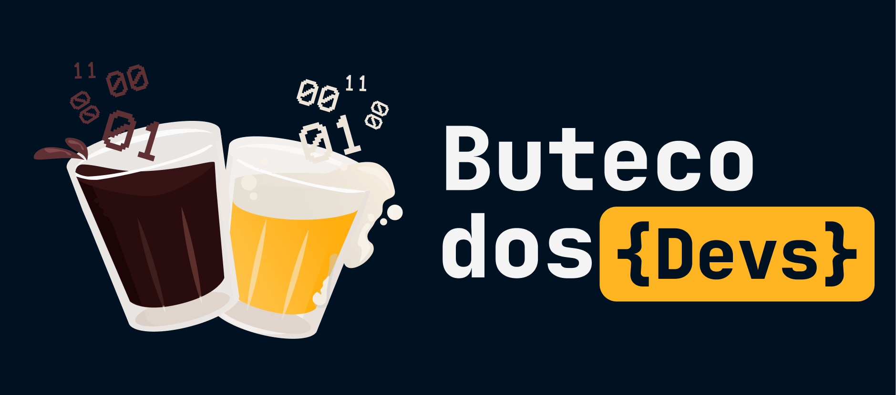

<h1 align="center">Memes Buteco dos Devs</h1>

<p align="center">
  

  

  

  
  
  
  
  
</p>

  <!--  -->

<!-- Status -->

<!-- <h4 align="center">
	🚧  PokeReal:dex 🚀 Em construção...  🚧
</h4>  -->

<hr>

<!-- <p align="center">
  <a href="#dart-sobre">Sobre</a> &#xa0; | &#xa0;
  <a href="#sparkles-funcionalidades">Funcionalidades</a> &#xa0; | &#xa0;
  <a href="#rocket-tecnologias">Tecnologias</a> &#xa0; | &#xa0;
  <a href="#white_check_mark-pré-requisitos">Pré requisitos</a> &#xa0; | &#xa0;
  <a href="#checkered_flag-começando">Começando</a> &#xa0; | &#xa0;
  <a href="#memo-licença">Licença</a> &#xa0; | &#xa0;
  <a href="https://github.com/navegantes" target="_blank">Autor</a>
</p> -->

<br>

<div align="center" id="top"> 
  
</div>

# 🍻 Sobre

A página Memes Buteco dos Devs reuni todo o matérial descontraído proveniente da mente criativa dos membros da nossa comunidade. Os memes, os audios e os vídeos são fruto ~~da nossa sessão de terapia diária~~ dos nossos encontro diário, uma forma da nossa comunidade ter um momento de diversão, reflexões filosoficas e descontração em meio ao estresse da vida de desenvolvedor de software. Faça parte dos mais 13k desenvolvedores do Buteco mais entrozado da bolha tech.

# 💻 Tecnologias

- ReactJS
- TailwindCSS
- Typescript
- NodeJS

## 🎀 Melhorias, Firulas e Frufrus

<!-- - [ ] Hover deve deslizar na navbar. -->

"Não palpite commite"  
Solte sua criatividade e dê sua contribuição.

- [ ] Paginas devem ter paginação; Carregamento conforme o scroll ou botão "abrir mais".
- [ ] Pagina Audio deve mostrar a onda/frequencia animada no destaque ao tocar o audio.
- [ ] Destaque das paginas (?Memes/Audio) devem subir/descer com o scroll.
- [ ] Carrossel infinito nos depoimentos da home.
- [ ] Implementar controle de volume.

<!-- # React + TypeScript + Vite

This template provides a minimal setup to get React working in Vite with HMR and some ESLint rules.

Currently, two official plugins are available:

- [@vitejs/plugin-react](https://github.com/vitejs/vite-plugin-react/blob/main/packages/plugin-react/README.md) uses [Babel](https://babeljs.io/) for Fast Refresh
- [@vitejs/plugin-react-swc](https://github.com/vitejs/vite-plugin-react-swc) uses [SWC](https://swc.rs/) for Fast Refresh

## Expanding the ESLint configuration

If you are developing a production application, we recommend updating the configuration to enable type aware lint rules:

- Configure the top-level `parserOptions` property like this:

```js
export default tseslint.config({
  languageOptions: {
    // other options...
    parserOptions: {
      project: ["./tsconfig.node.json", "./tsconfig.app.json"],
      tsconfigRootDir: import.meta.dirname,
    },
  },
});
```

- Replace `tseslint.configs.recommended` to `tseslint.configs.recommendedTypeChecked` or `tseslint.configs.strictTypeChecked`
- Optionally add `...tseslint.configs.stylisticTypeChecked`
- Install [eslint-plugin-react](https://github.com/jsx-eslint/eslint-plugin-react) and update the config:

```js
// eslint.config.js
import react from "eslint-plugin-react";

export default tseslint.config({
  // Set the react version
  settings: { react: { version: "18.3" } },
  plugins: {
    // Add the react plugin
    react,
  },
  rules: {
    // other rules...
    // Enable its recommended rules
    ...react.configs.recommended.rules,
    ...react.configs["jsx-runtime"].rules,
  },
});
``` -->

## 🤝 Colaboradores do Buteco

Agradecemos às seguintes pessoas que contribuíram para este projeto:

<table>
  <tr>
    <td align="center">
      <a href="#">
        <br>
        <sub>
          <b>Navegantes</b>
        </sub>
      </a>
    </td>
    <td align="center">
      <a href="https://github.com/CodeMoreira">
        <br>
        <sub>
          <b>Gabriel Moreira Mattos</b>
        </sub>
      </a>
    </td>
  </tr>
</table>
